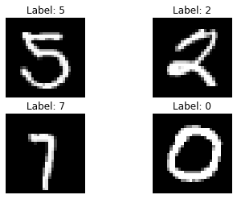
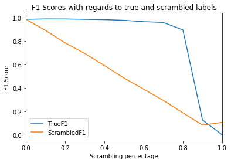

# Training Neural Networks with Noisy Labels

Neural networks, especially deep neural networks with many parameters, require a large amount of training data. This has led to the development of sophisticated data augmentation methods as well as entire industries dedicated to data annotation. The validation of these annotation labels is a common problem whenever such a large amount of data is involved as incorrect, or noisy, labels can lead to incorrectly trained machine learning algorithms that do not properly identify patterns within the data.

All code can be found on the Github repository, [Learning with Noisy Labels](https://github.com/DragonDuck/LearningWithNoisyLabels).

## Imports


```python
# Ensure reproducible results
import numpy as np
np.random.seed(101)
import tensorflow 
tensorflow.set_random_seed(101)
import pandas as pd
import h5py
import matplotlib.pyplot as plt
%matplotlib inline
import sklearn.model_selection
import sklearn.metrics
import keras.utils
from keras.models import Model
from keras.layers import Input, Conv2D, MaxPool2D, Dense, Flatten
```

## The Data
To showcase the effects of noisy labels, I will use the [MNIST handwritten digit dataset](http://yann.lecun.com/exdb/mnist/). I have previously downloaded and pre-processed the data and stored it in an HDF5 file.


```python
with h5py.File("MNIST.h5", "r") as h5handle:
    images = h5handle["images"][()]
    labels = h5handle["labels"][()]
```

The images are stored as a 4D array (Tensorflow format: batch size, width, height, number of channels) and the labels are a simple 1D array.


```python
print("Images array shape: {}".format(images.shape))
print("Labels array shape: {}".format(labels.shape))
```

    Images array shape: (70000, 28, 28, 1)
    Labels array shape: (70000,)


A look at some of the digits shows us the expected output.


```python
fig, ax = plt.subplots(2, 2);
ax[0, 0].imshow(images[284, ..., 0], cmap="gray");
ax[0, 0].set_title("Label: " + str(labels[284]));
ax[0, 0].axis("off");
ax[0, 1].imshow(images[1129, ..., 0], cmap="gray");
ax[0, 1].set_title("Label: " + str(labels[1129]));
ax[0, 1].axis("off");
ax[1, 0].imshow(images[9470, ..., 0], cmap="gray");
ax[1, 0].set_title("Label: " + str(labels[9470]));
ax[1, 0].axis("off");
ax[1, 1].imshow(images[30044, ..., 0], cmap="gray");
ax[1, 1].set_title("Label: " + str(labels[30044]));
ax[1, 1].axis("off");
plt.show()
```





I separate the data into a training and a test dataset.

## The Model
I'll be using a simple convolutional network for this task. MNIST is an extremely easy dataset to classify and doesn't require a particularly sophisticated model.


```python
def get_model(img_shape, nclasses):
    """
    Build convolutional network
    :param img_shape:
    :param nclasses:
    :return:
    """
    inputs = Input(shape=img_shape, name="Input")
    conv1 = Conv2D(
        filters=32, kernel_size=(3, 3),
        activation="relu", padding="valid",
        strides=(1, 1), name="Conv1")(inputs)
    conv2 = Conv2D(
        filters=32, kernel_size=(3, 3),
        activation="relu", padding="valid",
        strides=(1, 1), name="Conv2")(conv1)
    maxpool1 = MaxPool2D(
        pool_size=(3, 3), strides=(2, 2), 
        padding="valid", name="MaxPool1")(conv2)

    conv3 = Conv2D(
        filters=64, kernel_size=(3, 3),
        activation="relu", padding="valid",
        strides=(1, 1), name="Conv3")(maxpool1)
    conv4 = Conv2D(
        filters=64, kernel_size=(3, 3),
        activation="relu", padding="valid",
        strides=(1, 1), name="Conv4")(conv3)
    maxpool2 = MaxPool2D(
        pool_size=(3, 3), strides=(2, 2), 
        padding="valid", name="MaxPool2")(conv4)

    flattened = Flatten(name="Reshape")(maxpool2)

    outputs = Dense(name="Dense", units=nclasses, activation="sigmoid")(flattened)

    model = Model(inputs=inputs, outputs=outputs)
    model.compile(loss="categorical_crossentropy", optimizer="Adam")
    
    return model
```


```python
model = get_model(
    img_shape=images.shape[1:4], 
    nclasses=len(np.unique(labels)))
```

    WARNING:tensorflow:From /home/jan/anaconda3/envs/py3/lib/python3.7/site-packages/tensorflow/python/framework/op_def_library.py:263: colocate_with (from tensorflow.python.framework.ops) is deprecated and will be removed in a future version.
    Instructions for updating:
    Colocations handled automatically by placer.


```python
def print_model(model):
    desc = "Name      | Output Shape        | Kernel / Pool Shape\n"
    desc += "----------|---------------------|--------------------\n"
    for layer in model.layers:
        desc += "{:<10}|".format(layer.name)
        desc += " {:<20}|".format(str(layer.output_shape))
        if hasattr(layer, "kernel"):
            desc += " {:<20}".format(str(layer.kernel.shape.as_list()))
        if hasattr(layer, "pool_size"):
            desc += " {:<20}".format(str(layer.pool_size))
        desc += "\n"
    print(desc)
    
print_model(model)
```

    Name      | Output Shape        | Kernel / Pool Shape
    ----------|---------------------|--------------------
    Input     | (None, 28, 28, 1)   |
    Conv1     | (None, 26, 26, 32)  | [3, 3, 1, 32]       
    Conv2     | (None, 24, 24, 32)  | [3, 3, 32, 32]      
    MaxPool1  | (None, 11, 11, 32)  | (3, 3)              
    Conv3     | (None, 9, 9, 64)    | [3, 3, 32, 64]      
    Conv4     | (None, 7, 7, 64)    | [3, 3, 64, 64]      
    MaxPool2  | (None, 3, 3, 64)    | (3, 3)              
    Reshape   | (None, 576)         |
    Dense     | (None, 10)          | [576, 10]           
    


## Scrambling the labels
Next, I want to define a function that scrambles the labels. It's important that this function allows us to control the fraction of labels that are guaranteed to be correct. That means labels selected for scrambling may not get their original label assigned to them.


```python
def scramble_labels(labels, percentage, possible_values=None):
    """
    Takes a label vector and randomly scrambles a fraction of the labels.

    The scrambling ensures that none of the altered labels will have their
    original value, i.e. the scrambling percentage is guaranteed.

    By default, the function assumes that 'labels' contains all possible 
    label values. Should this not be the case, 'possible_values' can be used
    to pass a list of all possible labels.

    :param labels: Numpy array (num_labels,)
    :param percentage: Integer
    :param possible_values: Numpy array (num_unique_labels,)
    :return:
    """
    if percentage > 1:
        print("'scramble_freq' truncated to 1.0")
        percentage = 1.0

    if percentage == 0:
        return labels

    labels = labels.flatten()

    labels_to_scramble = np.random.choice(
        a=range(len(labels)),
        size=int(len(labels) * percentage),
        replace=False)

    # Define possible values for each entry
    if possible_values is None:
        possible_values = np.unique(labels)
    
    if not np.all(np.isin(np.unique(labels), possible_values)):
        raise ValueError(
            "'labels' contains values not found in 'possible_values'")
    
    possible_values = np.repeat(
        a=np.expand_dims(possible_values, 0),
        repeats=labels_to_scramble.shape[0],
        axis=0)
    forbidden_values = np.repeat(
        a=np.expand_dims(labels[labels_to_scramble], 1),
        repeats=len(np.unique(labels)), axis=1)

    sel = possible_values != forbidden_values
    new_possible_values = np.reshape(
        a=possible_values[sel],
        newshape=(possible_values.shape[0], possible_values.shape[1]-1))

    new_values = []
    for vals in new_possible_values:
        new_values.append(np.random.choice(vals))
    new_values = np.array(new_values)
    labels[labels_to_scramble] = new_values

    return labels
```

I can test this function with a dummy example:


```python
dummy_labels = np.arange(10)
print("Original labels: {}".format(dummy_labels))
print("10% scrambling:  {}".format(scramble_labels(dummy_labels, 0.1)))
print("50% scrambling:  {}".format(scramble_labels(dummy_labels, 0.5)))
print("100% scrambling: {}".format(scramble_labels(dummy_labels, 1)))
```

    Original labels: [0 1 2 3 4 5 6 7 8 9]
    10% scrambling:  [0 6 2 3 4 5 6 7 8 9]
    50% scrambling:  [0 1 2 3 9 3 8 8 8 0]
    100% scrambling: [5 9 7 8 8 2 8 8 0 4]


## Training and evaluating the model on scrambled labels
To assess the model's performance, I train the model on the scrambled labels but then assess its performance with regards to the true labels to ascertain how well it reconstructs the correct relationship between input data and true labels from the noisy training data. A comparison of the training and validation losses shows that the models are not overfitting.


```python
f1scores_real = []
f1scores_scrambled = []
training_histories = []
percentages = np.arange(0, 1.1, 0.1)

for p in percentages:
    scrambled_labels = scramble_labels(
        labels=labels, percentage=p)

    x_train, x_test, y_train, y_test, y_scr_train, y_scr_test = sklearn.model_selection.train_test_split(
        images, 
        keras.utils.to_categorical(labels), 
        keras.utils.to_categorical(scrambled_labels), 
        test_size=10000, random_state=101)

    training_histories.append(model.fit(
        x=x_train, y=y_scr_train,
        validation_split=0.3,
        batch_size=32, epochs=5, verbose=2))

    pred = model.predict(x=x_test)

    f1scores_real.append(
        sklearn.metrics.f1_score(
            y_true=np.argmax(y_test, axis=1),
            y_pred=np.argmax(pred, axis=1),
            average="weighted"))

    f1scores_scrambled.append(
        sklearn.metrics.f1_score(
            y_true=np.argmax(y_scr_test, axis=1),
            y_pred=np.argmax(pred, axis=1),
            average="weighted"))
```

    WARNING:tensorflow:From /home/jan/anaconda3/envs/py3/lib/python3.7/site-packages/tensorflow/python/ops/math_ops.py:3066: to_int32 (from tensorflow.python.ops.math_ops) is deprecated and will be removed in a future version.
    Instructions for updating:
    Use tf.cast instead.
    Train on 42000 samples, validate on 18000 samples
    Epoch 1/5
     - 39s - loss: 0.1782 - val_loss: 0.0752
    Epoch 2/5
     - 36s - loss: 0.0503 - val_loss: 0.0413
    Epoch 3/5
     - 38s - loss: 0.0357 - val_loss: 0.0356
    Epoch 4/5
     - 38s - loss: 0.0271 - val_loss: 0.0391
    Epoch 5/5
     - 39s - loss: 0.0233 - val_loss: 0.0435
    Train on 42000 samples, validate on 18000 samples
    Epoch 1/5
     - 42s - loss: 0.6430 - val_loss: 0.6335
    Epoch 2/5
     - 37s - loss: 0.6004 - val_loss: 0.6208
    Epoch 3/5
     - 37s - loss: 0.5794 - val_loss: 0.6246
    Epoch 4/5
     - 37s - loss: 0.5636 - val_loss: 0.6216
    Epoch 5/5
     - 37s - loss: 0.5456 - val_loss: 0.6312
    Train on 42000 samples, validate on 18000 samples
    Epoch 1/5
     - 35s - loss: 1.0037 - val_loss: 1.0009
    Epoch 2/5
     - 31s - loss: 0.9728 - val_loss: 1.0117
    Epoch 3/5
     - 34s - loss: 0.9550 - val_loss: 1.0080
    Epoch 4/5
     - 35s - loss: 0.9349 - val_loss: 1.0154
    Epoch 5/5
     - 41s - loss: 0.9119 - val_loss: 1.0257
    Train on 42000 samples, validate on 18000 samples
    Epoch 1/5
     - 33s - loss: 1.3348 - val_loss: 1.3446
    Epoch 2/5
     - 29s - loss: 1.3022 - val_loss: 1.3531
    Epoch 3/5
     - 30s - loss: 1.2804 - val_loss: 1.3584
    Epoch 4/5
     - 29s - loss: 1.2570 - val_loss: 1.3738
    Epoch 5/5
     - 30s - loss: 1.2312 - val_loss: 1.3752
    Train on 42000 samples, validate on 18000 samples
    Epoch 1/5
     - 31s - loss: 1.6142 - val_loss: 1.6128
    Epoch 2/5
     - 38s - loss: 1.5818 - val_loss: 1.6084
    Epoch 3/5
     - 37s - loss: 1.5610 - val_loss: 1.6150
    Epoch 4/5
     - 33s - loss: 1.5366 - val_loss: 1.6290
    Epoch 5/5
     - 32s - loss: 1.5080 - val_loss: 1.6440
    Train on 42000 samples, validate on 18000 samples
    Epoch 1/5
     - 31s - loss: 1.8440 - val_loss: 1.8436
    Epoch 2/5
     - 35s - loss: 1.8150 - val_loss: 1.8484
    Epoch 3/5
     - 33s - loss: 1.7937 - val_loss: 1.8500
    Epoch 4/5
     - 35s - loss: 1.7694 - val_loss: 1.8573
    Epoch 5/5
     - 38s - loss: 1.7377 - val_loss: 1.8815
    Train on 42000 samples, validate on 18000 samples
    Epoch 1/5
     - 34s - loss: 2.0340 - val_loss: 2.0400
    Epoch 2/5
     - 31s - loss: 2.0085 - val_loss: 2.0369
    Epoch 3/5
     - 29s - loss: 1.9896 - val_loss: 2.0426
    Epoch 4/5
     - 29s - loss: 1.9698 - val_loss: 2.0513
    Epoch 5/5
     - 28s - loss: 1.9407 - val_loss: 2.0737
    Train on 42000 samples, validate on 18000 samples
    Epoch 1/5
     - 28s - loss: 2.1815 - val_loss: 2.1719
    Epoch 2/5
     - 28s - loss: 2.1600 - val_loss: 2.1767
    Epoch 3/5
     - 28s - loss: 2.1460 - val_loss: 2.1783
    Epoch 4/5
     - 29s - loss: 2.1283 - val_loss: 2.1826
    Epoch 5/5
     - 29s - loss: 2.1030 - val_loss: 2.2028
    Train on 42000 samples, validate on 18000 samples
    Epoch 1/5
     - 28s - loss: 2.2753 - val_loss: 2.2737
    Epoch 2/5
     - 29s - loss: 2.2642 - val_loss: 2.2729
    Epoch 3/5
     - 29s - loss: 2.2557 - val_loss: 2.2775
    Epoch 4/5
     - 29s - loss: 2.2453 - val_loss: 2.2857
    Epoch 5/5
     - 28s - loss: 2.2283 - val_loss: 2.2915
    Train on 42000 samples, validate on 18000 samples
    Epoch 1/5
     - 28s - loss: 2.3056 - val_loss: 2.3026
    Epoch 2/5
     - 28s - loss: 2.3023 - val_loss: 2.3028
    Epoch 3/5
     - 29s - loss: 2.3020 - val_loss: 2.3034
    Epoch 4/5
     - 29s - loss: 2.3007 - val_loss: 2.3054
    Epoch 5/5
     - 28s - loss: 2.2984 - val_loss: 2.3061
    Train on 42000 samples, validate on 18000 samples
    Epoch 1/5
     - 29s - loss: 2.2954 - val_loss: 2.2844
    Epoch 2/5
     - 29s - loss: 2.2771 - val_loss: 2.2713
    Epoch 3/5
     - 28s - loss: 2.2629 - val_loss: 2.2636
    Epoch 4/5
     - 29s - loss: 2.2513 - val_loss: 2.2538
    Epoch 5/5
     - 28s - loss: 2.2383 - val_loss: 2.2507


```python
results = pd.DataFrame(
    data={
        "TrueF1": f1scores_real,
        "ScrambledF1": f1scores_scrambled},
    index=np.round(percentages, 2))
results.index.name = "Percentages"
results.to_csv("F1Scores.csv")
```

Comparing the F1 scores with regards to the true and the scrambled labels reveals a remarkable characteristic: the model is capable of learning the true relationship between input data and target variables even when up to $80\%$ of the training labels are scrambled! In fact, the model fails to properly learn the relationship between input data and the scrambled labels, as evidenced by the steadily-declining F1 score with regarrds to the scrambled labels.


```python
ax = results.plot(title="F1 Scores with regards to true and scrambled labels")
ax.set_xlabel("Scrambling percentage");
ax.set_ylabel("F1 Score");
```





## Conclusion
A neural network is clearly capable of learning the correct relationship between input data and target variables, even when training labels have been partially falsified. Astonishingly, the true performance doesn't gradually decrease but abruptly fails. In this case, the model performed near-perfectly up to a scrambling percentage of approximately $80\%$. For scrambling percentages above this threshold, the model fails entirely and performance drops to what would be expected of random guessing.

It needs to be said that the MNIST handwritten digits dataset is remarkably simple, which explains the high threshold. More complex datasets will have a lower threshold but should nevertheless elicit the same behaviour in models trained on noisy data.
