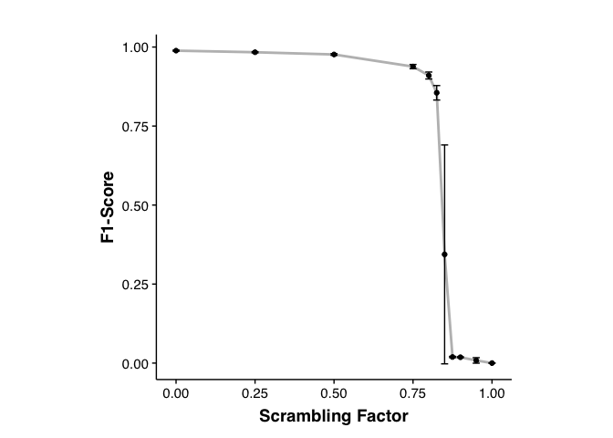
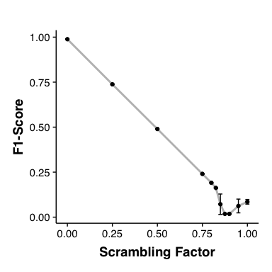
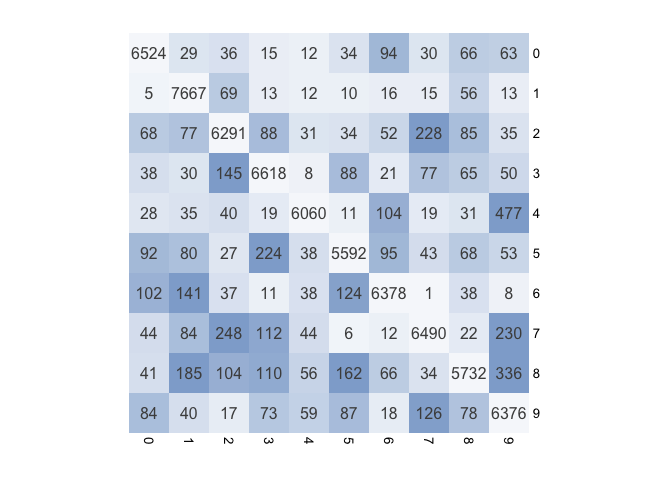
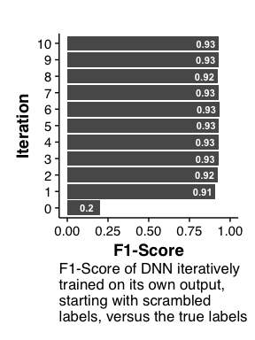
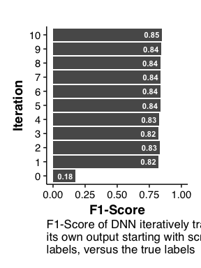

This experiment shows how deep neural networks (DNNs) perform on noisy
data. To this end, I trained a convolution DNN (structure:
conv-conv-pool-conv-conv-pool-dense) to classify MNIST handwritten
digits. However, the labels were randomly perturbed so that a defined
fraction of labels was guaranteed to be incorrect. After training, the
accuracy (F1-score) of the network was calculated *on the original,
unperturbed labels*. This mini-experiment shows that even after
significant scrambling, the true accuracy of the network remains nearly
unchanged.

    scrambling_results = read.csv(
      file = "Results_TrueScores_mnist_conv.csv", 
      header = TRUE, row.names = NULL)
    ggplot_df = data.frame(
      "X" = scrambling_results$X, 
      "Mean" = rowMeans(scrambling_results[,2:ncol(scrambling_results)]),
      "Var" = apply(scrambling_results[,2:ncol(scrambling_results)], 1, sd))

    ggplot(data = ggplot_df, mapping = aes(x = X, y = Mean)) + 
      geom_line(size = 1, color = "gray") + geom_point() + 
      geom_errorbar(
        mapping = aes(ymin = Mean - Var, ymax = Mean + Var)) + 
      coord_fixed() + custom_theme() + 
      labs(x = "Scrambling Factor", y = "F1-Score")

    ggsave("Results_TrueScores_mnist_conv.pdf", width = 4, 
           height = 4, useDingbats = FALSE)

Out of interest, I also take a look at the accuracies on the scrambled
labels, i.e. the labels the network was trained on. The accuracy with
regards to the incorrect labels decreases rapidly as the scrambling rate
increases. The accuracy of a DNN on its training data could therefore be
used as a measure of how noisy the labels are. Further study is required
to differentiate label noise from an ill-trained DNN, however.

    scrambling_results = read.csv(
      file = "Results_ScrambledScores_mnist_conv.csv", 
      header = TRUE, row.names = NULL)
    ggplot_df = data.frame(
      "X" = scrambling_results$X, 
      "Mean" = rowMeans(scrambling_results[,2:ncol(scrambling_results)]),
      "Var" = apply(scrambling_results[,2:ncol(scrambling_results)], 1, sd))

    ggplot(data = ggplot_df, mapping = aes(x = X, y = Mean)) + 
      geom_line(size = 1, color = "gray") + geom_point() + 
      geom_errorbar(
        mapping = aes(ymin = Mean - Var, ymax = Mean + Var)) + 
      coord_fixed() + custom_theme() + 
      labs(x = "Scrambling Factor", y = "F1-Score")

    ggsave("Results_ScrambledScores_mnist_conv.pdf", width = 4, 
           height = 4, useDingbats = FALSE)

I take a look at the confusion matrix of predictions versus true labels.
I average the results over all repetitions.

    scrambling = "0.8"

    scrambling_rates = h5read(
      file = "Results_PredictedLabels_mnist_conv.h5", 
      name = "scrambling_rate")
    pred_labels = h5read(
      file = "Results_PredictedLabels_mnist_conv.h5", 
      name = "data", index = list(
        NULL, NULL, which(scrambling_rates == scrambling)))[,,1]
    H5close()

    true_labels = h5read(file = "MNIST.h5", name = "labels")
    H5close()

    confmats = list()
    for(rep in seq_len(dim(pred_labels)[2])) {
      confmats[[rep]] = table("True" = true_labels, "Pred" = pred_labels[,rep])
    }

    conf_mat = abind(confmats, along = 3)
    conf_mat = apply(conf_mat, c(1, 2), mean)
    conf_lab = round(conf_mat)
    diag(conf_mat) = 0
    hm_colorScale = colorRampPalette(
      c("#f6f8fb", "#DAE3F0", "#B5C8E1", rep("#8FACD2", 9)))(150)
    pheatmap(
      mat = conf_mat, cluster_cols = FALSE, cluster_rows = FALSE, 
      color = hm_colorScale, display_numbers = conf_lab, fontsize_number = 12, 
      legend = FALSE, cellwidth = 30, cellheight = 30, 
      border_color = NA)

    pheatmap(
      mat = conf_mat, cluster_cols = FALSE, cluster_rows = FALSE, 
      color = hm_colorScale, display_numbers = conf_lab, fontsize_number = 12, 
      legend = FALSE, cellwidth = 30, cellheight = 30, 
      border_color = NA, filename = sprintf(
        "Results_PredictedLabels_Heatmap_mnist_conv_%s.pdf", scrambling))

Next, I tested if iterative training, i.e. training a DNN on the outputs
of the previous iteration, showed any improvement. To this end, I
initially scrambled the labels so that 80% of them are incorrect
(iteration 0). The network was trained on the scrambled labels, its
accuracy evaluated, and the labels predicted for the entire dataset.
These new labels were used to train the next iteration of the DNN. There
seems to be no benefit to iterative training. While the accuracy still
increases slowly, the time cost of training over so many iterations far
outweighs the benefits of a minor increase in accuracy.

    iteration_results = read.csv(
      file = "ResultsIterative_mnist_conv_0.8.csv", 
      header = TRUE, row.names = NULL)
    iteration_results$X = as.factor(iteration_results$X)
    iteration_results$TextLoc = iteration_results$TrueF1 - 0.08
    iteration_results$Text = round(iteration_results$TrueF1, 2)

    ggplot(data = iteration_results, mapping = aes(x = X, y = TrueF1)) + 
      geom_col() + geom_text(mapping = aes(x = X, y = TextLoc, label = Text), 
                             color = "White", fontface = "bold", size = 3) +
      custom_theme() + ylim(c(0, 1)) + coord_flip() + 
      labs(
        x = "Iteration", y = "F1-Score", 
        caption = paste0(
           "F1-Score of DNN iteratively\n",
           "trained on its own output,\n",
           "starting with scrambled\n",
           "labels, versus the true labels"))

    ggsave("ResultsIterative_mnist_conv_0.8.pdf", width = 3, 
           height = 4, useDingbats = FALSE)

Testing this for a higher scrambling degree of 82.5% shows that
iteration still offers no benefit. However, the network saturates at a
lower accuracy.

    iteration_results = read.csv(
      file = "ResultsIterative_mnist_conv_0.825.csv", 
      header = TRUE, row.names = NULL)
    iteration_results$X = as.factor(iteration_results$X)
    iteration_results$TextLoc = iteration_results$TrueF1 - 0.08
    iteration_results$Text = round(iteration_results$TrueF1, 2)

    ggplot(data = iteration_results, mapping = aes(x = X, y = TrueF1)) + 
      geom_col() + geom_text(mapping = aes(x = X, y = TextLoc, label = Text), 
                             color = "White", fontface = "bold", size = 3) +
      custom_theme() + ylim(c(0, 1)) + coord_flip() + 
      labs(
        x = "Iteration", y = "F1-Score", 
        caption = paste0(
           "F1-Score of DNN iteratively trained on\n",
           "its own output starting with scrambled\n",
           "labels, versus the true labels"))

    ggsave("ResultsIterative_mnist_conv_0.825.pdf", width = 3, 
           height = 4, useDingbats = FALSE)
